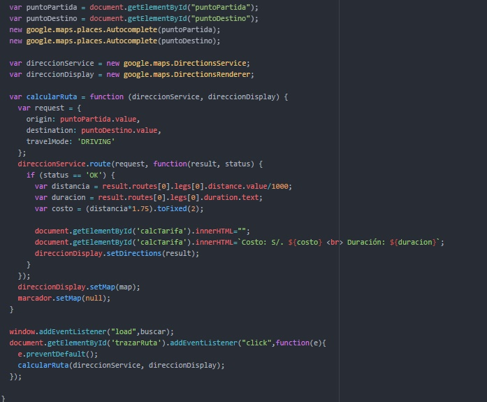

# Lab Car
Labcar es una empresa de taxis que te permite pedir un taxi cuando quieras y en donde quieras.
## La página web de Labcar esta conformada por:
- navbar
- hero
- information
- drive
- tarifa
- footer

Cada sección se desarrollo en diferentes ramas, empezando por el navbar y finalizando con footer.

El sitio web se desarrollo con CSS, HTML, JS, y uso de API de google Maps.

Al cargar la página web nos solicita permiso para localizar nuestra ubicacion, se debe permitir para encontrar nuestra ubicación y 
poder calcular la distancia.

Desarrollado por: Miriam Peralta Castañeda

**Ver web page aqui:** https://miriampc.github.io/proyecto-final-sprint4/

# LabCar | Servicio de Taxi

## El proyecto
Proyecto final del Sprint4 del Bootcamp de Laboratoria < l >

- El proyecto consiste en implementar una página web que ofrece el servicio de taxi, dar la ubicación actual del usuario y le permita ingresar su punto de partida y punto de destino y mostrar la tarifa del recorrido.
- Para el desarrollo del proyecto se usó el framework de css Bootstrap.

## Fuentes consultadas:
- Bootstrap: url(http://getbootstrap.com/components/)
- Google MapsAPI: url(https://developers.google.com/maps/?hl=es-419)

## LabCar: contenido

### Nav-Hero
El nav en la versión mobile aparece como una menú tipo hamburguesa. 

En la versión desktop se visualiza así: 

### Información
En esta sección tenemos una maquetado que utiliza clases de bootstrap como thumbnail entre otras 

### Conduce
Aquí se aplican conocimientos previos como hacer un background con color en rgba entre otros recursos 

### Tarifa
En esta sección aparecerá el mapa con nuestra ubicación, al permitirle al navegador que acceda a nuestros datos, para lo cual empleamos el Api de HTML5 y el Api de Google Maps 
- Para usar el Api de Google Maps necesitamos colocar este script en nuestro html (En este script hay que colocar nuestra key, generada en https://developers.google.com/maps/documentation/javascript/places?hl=es-419#place_searches):   

- Para trazar la ruta se hace uso de los recursos de la Api de Google Maps: 

- Para trazar la ruta como hemos visto en la función anterior se hizo uso de los objetos que nos proporciona esta api: google.maps.DirectionsService, el cual se encarga de obtener las coordenadas y con que medio te movilizas para indicarte las inflexiones;
google.maps.DirectionsRenderer, que en términos simples se encargará de traducir la ruta y plasmarlo por medio de líneas. Veamos como funciona:  

### Footer
Tiene varios links, se uso flexbox y el grid de bootstrap  

## Versión Mobile

## Desarrollado con:

`HTML` `JavaScript` `CSS` `BOOTSTRAP` `APIs`
